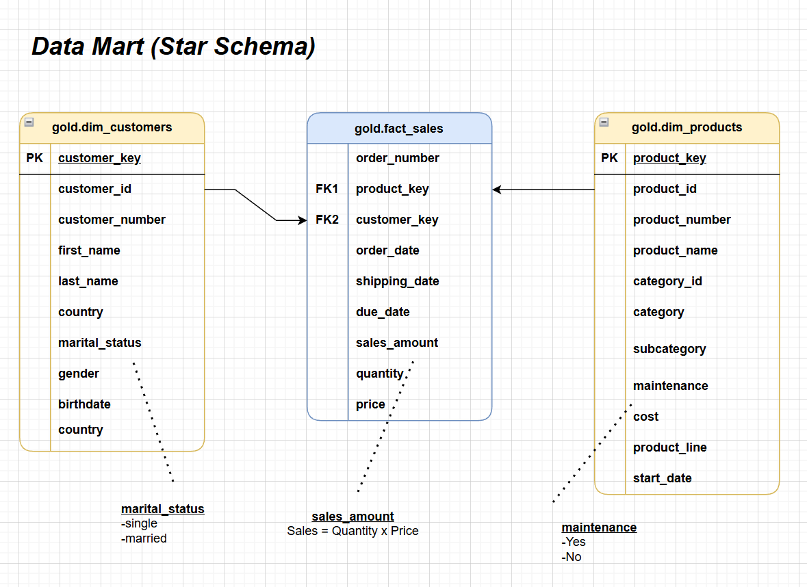
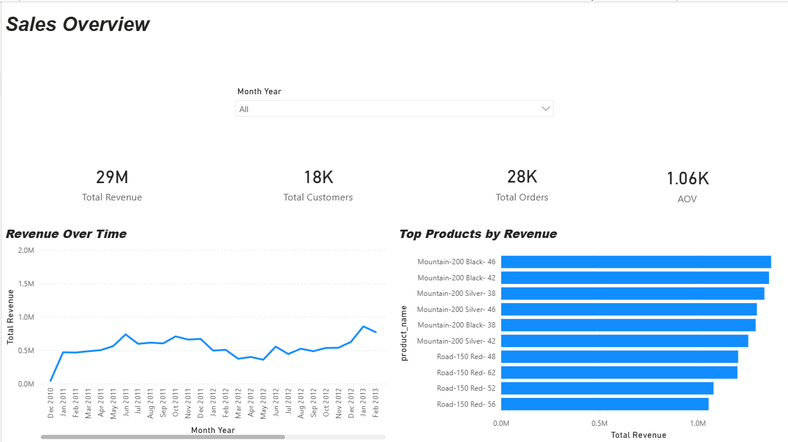
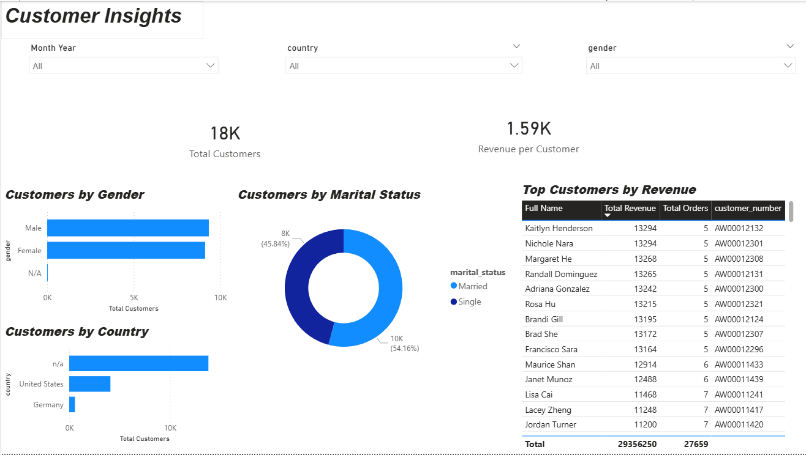
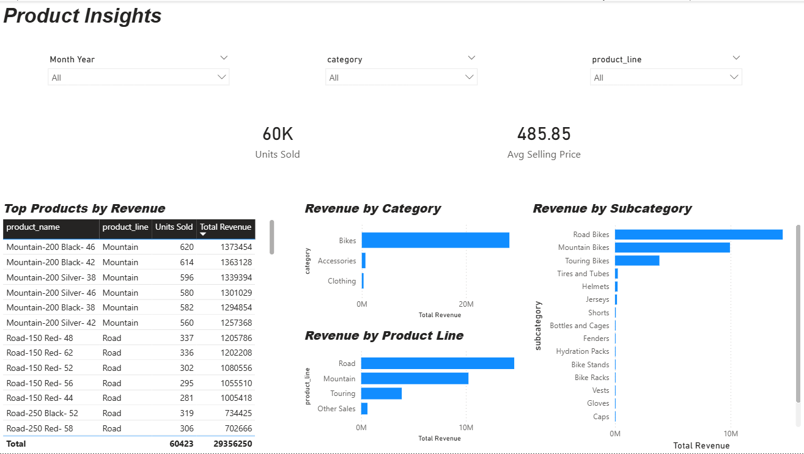

# Data Warehouse and Analytics Project

Welcome to the **Data Warehouse and Analytics Project** repository! 🚀  
This project builds a modern data warehouse in PostgreSQL using Medallion Architecture (**Bronze / Silver / Gold**) and delivers a **Power BI dashboard** for sales analytics. It consolidates ERP and CRM sales data into a star schema optimized for analytical queries, with ETL pipelines, data quality checks, and SQL-based reporting across customer behaviour, product performance, and sales trends.



---
## Data Architecture

The data architecture for this project follows Medallion Architecture **Bronze**, **Silver**, and **Gold** layers

1. **Bronze Layer**: Stores raw data as-is from the source systems. Data is ingested from CSV Files into PostgreSQL Database.
2. **Silver Layer**: This layer includes data cleansing, standardization, and normalization processes to prepare data for analysis.
3. **Gold Layer**: Houses business-ready data modeled into a star schema required for reporting and analytics.

---
## 📖 Project Overview

This project involves:

1. **Data Architecture**: Designing a Modern Data Warehouse Using Medallion Architecture **Bronze**, **Silver**, and **Gold** layers.
2. **ETL Pipelines**: Extracting, transforming, and loading data from source systems into the warehouse.
3. **Data Modeling**: Developing fact and dimension tables optimized for analytical queries.
4. **Analytics & Reporting**: Creating SQL-based reports and dashboards for actionable insights.

## 🚀 Project Requirements

### Building the Data Warehouse (Data Engineering)

#### Objective
Develop a modern data warehouse using PostgreSQL to consolidate sales data, enabling analytical reporting and informed decision-making.

#### Specifications
- **Data Sources**: Import data from two source systems (ERP and CRM) provided as CSV files.
- **Data Quality**: Cleanse and resolve data quality issues prior to analysis.
- **Integration**: Combine both sources into a single, user-friendly data model designed for analytical queries.
- **Scope**: Focus on the latest dataset only; historization of data is not required.
- **Documentation**: Provide clear documentation of the data model to support both business stakeholders and analytics teams.

---

## 📊 Power BI Dashboard

This project includes a 3-page Power BI dashboard built on top of the Gold layer star schema to support business reporting and decision-making.

### Dashboard Pages
- **Sales Overview**: High-level KPIs, revenue trends, and top-performing products.
- **Customer Insights**: Customer distribution by gender, marital status, and country, along with top customers by revenue.
- **Product Insights**: Product performance by revenue, category, subcategory, and product line.

### Dashboard Preview

#### Sales Overview


#### Customer Insights


#### Product Insights


### Power BI File
- `power_bi/sales_dashboard.pbix`

For more details, refer to [requirements.md](requirements.md).

## 📂 Repository Structure
```
data-warehouse-project/
│
├── datasets/                           # Raw datasets used for the project (ERP and CRM source files
│
├── docs/                               # Project documentation and architecture details
│   ├── etl_flow.png                    # Picture shows all different techniques and methods of ETL
│   ├── data_architecture.png           # Picture shows the project's architecture
│   ├── data_catalog.md                 # Catalog of datasets, including field descriptions and metadata
│   ├── data_flow.png                   # Picture for the data flow diagram
│   ├── data_model.png                  # Picture for data models (star schema)
│   ├── naming-conventions.md           # Consistent naming guidelines for tables, columns, and files
│   ├── customer_insights.png/          # Picture of customer insights              
│   ├── product_insights.png            # Picture of product insights
│   ├── sales_overview.png/             # Picture of sales overview
│
├── scripts/                            # SQL scripts for ETL and transformations
│   ├── bronze/                         # Scripts for extracting and loading raw data
│   ├── silver/                         # Scripts for cleaning and transforming data
│   ├── gold/                           # Scripts for creating analytical models
│
├── power_bi/                           # Power BI dashboard files
│   ├── sales_dashboard.pbtx            # Main Power BI dashboard                    
|    
├── tests/                              # Test scripts and quality files
│
├── README.md                           # Project overview and instructions
├── LICENSE                             # License information for the repository
├── .gitignore                          # Files and directories to be ignored by Git
└── requirements.txt                    # Dependencies and requirements for the project
```
---


## 🛡️ License

This project is licensed under the [MIT License](LICENSE). You are free to use, modify, and share this project with proper attribution.

